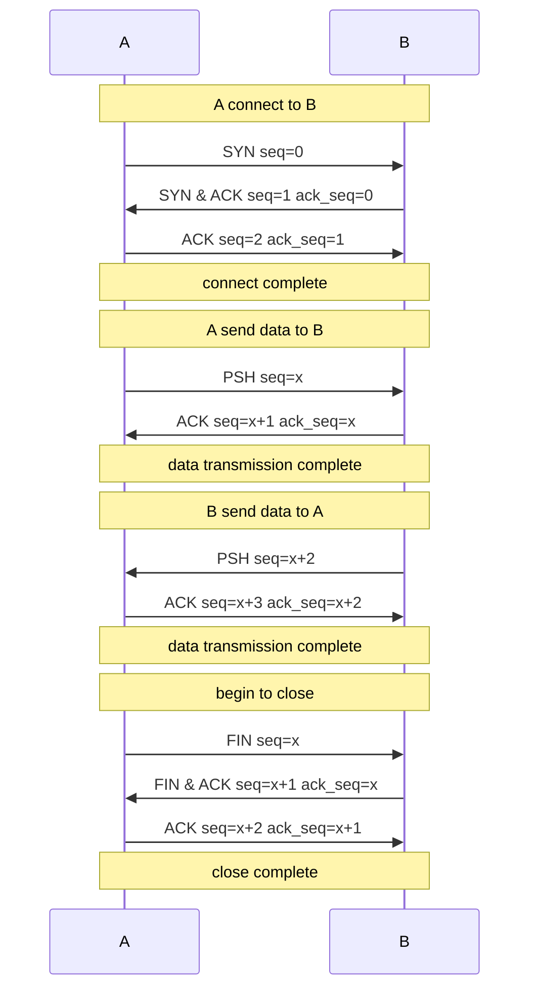
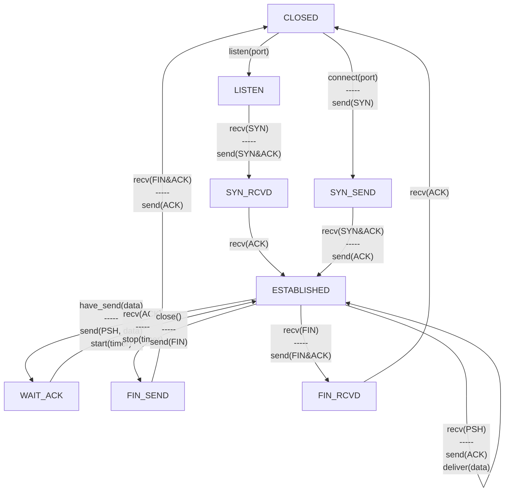

# 简易TCP/IP与UDP接口实现（Slip）

Super Lightweight Internet Protocol Inplementation based on C++.

项目组成员：

* 欧一锋(@a20185) **(组长)**
* 王天宇
* 王毅峰
* 赵子琳(@SakurazukaKen)
* 郑齐(@tidyzq)


## 项目目录结构：

TCP（主目录）

* README.md
* Makefile
* *bin*  (存放此实现的测试类编译后生成的**二进制文件**)
  * tcptest
  * udptest
* *build* (存放此实现编译过程中生成的**.o文件**)
  * tcp.o
  * *test*
    * tcptest.o
    * udptest.o
  * udp.o
  * utils.o
* *demo* (存放基于此实现的一个**小应用**)
  * *include* (存放实现**小应用**的所有需要用到的C++头文件)
  * *src* (存放**小应用**的所有C++文件)
  * *bin* (存放实现**小应用**编译后生成的**二进制文件**)
  * Makefile
* *include* (存放此实现的所有需要用到的C++头文件)
  * tcp.hpp
  * udp.hpp
  * utils.hpp
* *src* (存放基于此实现的所有C++文件)
  * tcp.hpp
  * udp.hpp
  * utils.hpp
* test(存放基于此实现的测试类的C++文件)
  * tcptest.cpp
  * udptest.cpp


## [注意事项]
由于本项目使用了 *raw socket*, 因此**需要 root 权限才能正常运行**, 同时需要设置 ip 转发**防止内核自动终止 tcp 包**
* 关闭 ubuntu 防火墙
  ```shell
  sudo ufw disable
  ```
* 关闭 iptabls 转发的自动 RST
  ```shell
  sudo iptables -A OUTPUT -p tcp --tcp-flags RST RST -j DROP
  ```


## 使用方式:

* Shell 下进入本目录执行`make`命令即可编译。
* 执行测试可以使用`bin`目录下的 *tcptest* 以及 *udptest* 文件。
* 测试文件使用方法：
  * ### tcptest

    * ```shell
      sudo ./tcptest l [listen-port]
      ```

      * 指定程序监听本机`listen-port`端口的tcp连接。

    * ```shell
      sudo ./tcptest s [dest-ip] [dest-port] [source-port] [pkg-count]
      ```

      * 指定程序使用本地的`source-port`端口向ip为`dest-ip`的`dest-port`端口发起tcp连接, 并自动发送`pkt-count`个测试包。

    * **mode**: 指定tcp使用模式。**s**为主动连接，**l**为监听端口。

    * **dest-ip**: 目的主机的ip地址。

    * **dest-port**: 目的主机的端口。

    * **source-port**: 本地主机的端口。

    * **pkt-count**: 自动发送测试数据包的个数。

  * ### udptest

    * ```shell
      sudo ./udptest l [listen-port] [pkt-count]
      ```

      * 指定程序监听本机`listen-port`端口的udp连接, 当收到`pkt-count`个数据包后终止程序。

    * ```shell
      sudo ./udptest s [dest-ip] [dest-port] [source-port] [pkt-count]
      ```

      * 指定程序使用本地的`source-port`端口向ip为`dest-ip`的`dest-port`端口自动发送`pkt-count`个udp测试包。

    * **mode**: 指定udp使用模式。**s**为发送，**l**为接收。

    * **dest-ip**: 目的主机的ip地址。

    * **dest-port**: 目的主机的接收端口。

    * **source-port**: 本地主机的发送端口。

    * **pkt-count**: 测试发送的数据报文包(*datagram packet*)数量。


## 本实现的API接口：

### Utils类：

 (通过*命名空间* 调用即可，本类置于*namespace slip* 中)

* **校验和计算方法：**

  * 使用方式:

  * ```c++
    unsigned short calc_checksum(unsigned long source_ip,
                  unsigned long dest_ip,
                  u_int8_t protocol,
                  char* payload,
                  unsigned short payload_len);
    ```

    * *source_ip*: 源主机ip
    * *dest_ip*：目的主机ip
    * *protocol*： 8位协议号
    * *payload*:   数据包
    * *payload_len*: 数据包长度


* **校验和检查方法:**

  * 使用方式:

  * ```c++
    bool verify_checksum(unsigned long source_ip,
                         unsigned long dest_ip,
                         u_int8_t protocol,
                         char* payload,
                         unsigned short payload_len,
                         unsigned short checksum);
    ```

    * *source_ip*:    源主机ip地址
    * *dest_ip*:    目的主机ip地址
    * *protocol*:    8位协议号
    * *payload*:   数据包
    * *payload_len*:   数据包长度
    * *checksum*:    传入的原始报文校验和


* 获取本地IP方法：

  * 使用方法：

  * ```c++
    std::string get_local_ip();
    ```

    * 返回为*调用者本机*的IP


---------------------------------------------------------------------------------------------------------------


### UDP类

（此类使用时通过本类对象方法调用）

```c++
slip::Udp udp; //此为示例中的方法
```


* **添加监听器方法**：

  注意：本类*必须* 调用添加监听器方法之后才可正常接收UDP信息。

  * 使用方法：

    ```c++
    udp.add_listener(listen_port,
                     std::function<void(std::string,
                                        unsigned short,
                                        std::string)>);
    ```

    * *listen_port*： 为监听端口（远程主机的接收端口）。
    * 参数2为**监听函数**：写成*lambda*表达式。
    * 返回值为 *listener_ptr* , 可以用于之后的监听器删除

    ```c++
    //调用样例,详情请参照test/udptest.cpp
    udp.add_listener(listen_port,
                     [&count](std::string source_ip,
                              unsigned short source_port,
                              std::string message)
                     -> void {
          					// do something
         					 ++count;
       					 }
                    );
    ```


* **移除监听器方法**:

  * 使用方法：

    ```c++
    udp.remove_listener(unsigned short port,
                        Udp::listener_ptr ptr);
    ```

    * *port*: 为监听端口（远程主机的接收端口）。
    * *listener_ptr* : 添加监听器时返回的监听器指针。
    * 返回值为删除操作是否成功的*bool*值。


* **数据报文包发送方法**：

  * 使用方法：

    ```c++
    udp.send(std::string dest_ip,
             unsigned short dest_port,
             unsigned short source_port,
             std::string data);
    ```

    * *dest_ip*:  目的主机ip地址
    * *dest_port*:  目的主机端口
    * *source_port*:  源主机端口
    * *data*:  发送的数据，字符串形式


------


### TCP类

首先需要通过`tcp.connect` 或者 `tcp.listen` 取得 `tcp控制块`的指针

```c++
tcp_pcb_ptr connect(std::string dest_ip,
                    unsigned short dest_port,
                    unsigned short source_port);

tcp_pcb_ptr listen(unsigned short source_port);
```

`tcp.connect` 和 `tcp.listen` 区分主要为发出连接请求和接收连接请求。参数与上面的方法中的同名参数类似，此处不再赘述。


随后发送端需要通过`tcp控制块`进行发送和关闭连接操作。通过调用`pcb -> send(message)`以及 `pcb -> close()` 即可达成以上功能。

对于接收端，只需要类似于上面的UDP类中那样，调用`pcb -> add_listener()` 那样添加好监听器便可以实现接收的功能了。

## TCP 过程模型

本项目的tcp实现参考了标准的tcp协议模型与比特交换协议模型, tcp头与标准tcp头相同, 而连接状态与握手次数方面进行了一些修改, 具体变化如下:

+ 数据交换**采用停等策略**, 即确定一个序列已被接收且无错后才会发送下一个序列.
+ 结束时的**4次握手改为3次握手**, 3次握手内容与建立连接的3次握手相似, 即**将原本的中间两个 fin 和 ack 包合并**为一个 fin & ack 包.

### TCP 流程图



### TCP 状态图




